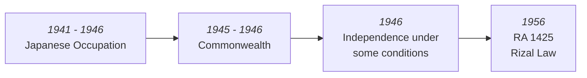
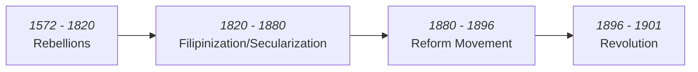

# Life and Works of Rizal

Capstone - book review on "Jose Rizal and the University of Santo Tomas"

## Republic Act 1425 - The Rizal Law (1945)
- Study the life and works of Rizal
- REQUIRED
- Basic Education - Noli Me Tangere & El Filibusterismo
	- Presents *most* Spaniards as greedy, abusive, cruel (The Friars)
- Passed by:
	- **Claro M. Recto** - "Filipinos were losing their sense of Nationalism"
	- **Jose P. Laurel**
	- **Roseller Lin** - Philippinization of Schools
- Opposed by:
	- **Francisco Rodrigo** - President of *Holy Name Society*
	- **Desporso Rosales**
	- **Mariano Cuenduo**

- **Tidings McDuffie Act**
	- Grants Philippines independence and a *10 year republic*
	- In exchange for fighting the Japanese

- **Manuel Roxas** gained independence but with *(1946)*:
	- Parity Rights
	- Military Bases for 99 Years (cut off at 1991)
	- American **Neo-Colonialism**

- **Nationalism** - Ideology for Liberation/Freedom
	- Colonial Policies
	- Taxes
	- Polo y Servicios\
	- Discrimination
		- **Peninsulades** - Spaniards Coming from Spain
		- **Inculares (Filipinos)** - Spaniards born in Philippines
		- **Mestizos/Creoles** - Half bloods
		- **Intsik** - Heathens necessary for business
		- **Indios** - Modern Filipino

1. Diary of Rizal
2. Paglinis sa Tinubuang Lupa (innate feelings)
3. Noli Me Tangere

### Noli Me Tangere
- Dedicated to **Gomburza**
- Semiotics (allegories)
	- Padre Damaso demanding bigger part of the chicken\
	- Two tiers of the boat 
	- Other symbolisms
#### Characters
1. **Padre Damaso** - Puppet Master
2. **Pilosopo Tasyo** - Intellectual (Based on his brother Pasyano)
3. **Donya Victorina** - Social Climber (pretending to be spanish)
4. **Sisa** - Martyr
5. **Maria Clara** - Ideal Filipina
6. 